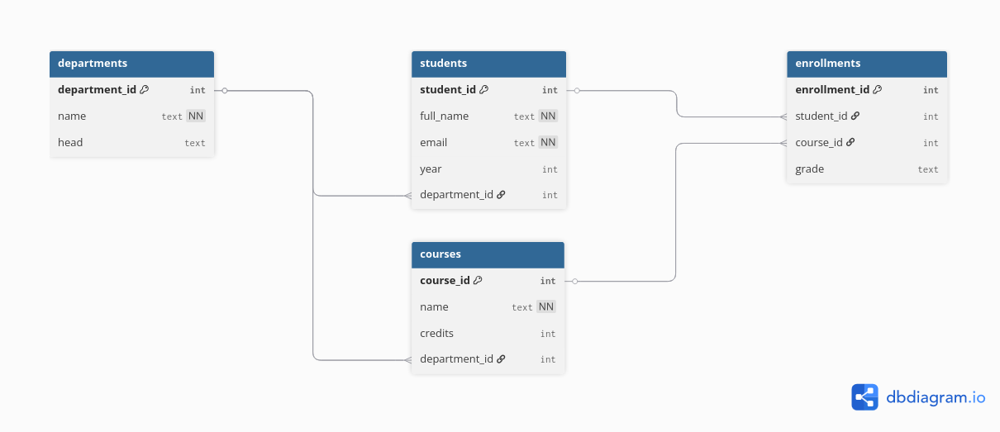

# Task 3 — Database Design & ER Diagram

## Objective

The objective of Task 3 is to design a **normalized relational database schema** based on identified entities, define relationships with proper constraints, and validate the design through execution and test data.

This task is independent of Task 2 data and focuses purely on **correct database modeling and performance-oriented design**.

---

## Entities Identified

The following core entities were identified during schema design:

1. **Department** – Represents an academic department
2. **Student** – Represents a student enrolled in the institution
3. **Course** – Represents a course offered by a department
4. **Enrollment** – Represents a student enrolling in a course (junction table)

---

## Entity Descriptions & Attributes

### Department

| Attribute     | Description            |
| ------------- | ---------------------- |
| department_id | Primary key            |
| name          | Unique department name |
| head          | Department head        |

---

### Student

| Attribute     | Description               |
| ------------- | ------------------------- |
| student_id    | Primary key               |
| full_name     | Student full name         |
| email         | Unique student email      |
| year          | Academic year             |
| department_id | Foreign key to Department |

---

### Course

| Attribute     | Description               |
| ------------- | ------------------------- |
| course_id     | Primary key               |
| name          | Course name               |
| credits       | Number of credits         |
| department_id | Foreign key to Department |

---

### Enrollment

| Attribute     | Description            |
| ------------- | ---------------------- |
| enrollment_id | Primary key            |
| student_id    | Foreign key to Student |
| course_id     | Foreign key to Course  |
| grade         | Final grade            |

---

## Relationships

| Relationship         | Cardinality            |
| -------------------- | ---------------------- |
| Department → Student | 1 : N                  |
| Department → Course  | 1 : N                  |
| Student → Course     | N : M (via Enrollment) |

The **Enrollment** table acts as a junction table to model the many-to-many relationship between students and courses.

---

## Normalization

The schema is normalized up to **Third Normal Form (3NF)**:

* All attributes are atomic (1NF)
* No partial dependencies (2NF)
* No transitive dependencies (3NF)

Department information is not duplicated in Student or Course tables, and course details are not duplicated in Enrollment.

---

## Constraints Applied

### Primary Keys

* departments.department_id
* students.student_id
* courses.course_id
* enrollments.enrollment_id

### Foreign Keys

* students.department_id → departments.department_id
* courses.department_id → departments.department_id
* enrollments.student_id → students.student_id
* enrollments.course_id → courses.course_id

### Unique Constraints

* students.email
* (enrollments.student_id, enrollments.course_id)

### Check Constraints

* students.year between valid academic range
* courses.credits > 0

---

## Indexing Strategy

Indexes were added to optimize joins and frequent lookups:

| Table       | Column        |
| ----------- | ------------- |
| students    | email         |
| students    | department_id |
| courses     | department_id |
| enrollments | student_id    |
| enrollments | course_id     |

---

## ER Diagram

The ER diagram was created using **dbdiagram.io** and visually represents:

* Entity relationships
* Primary and foreign keys
* Cardinality between tables

Layout follows a top-down hierarchy:

* Department at the top
* Student and Course in the middle
* Enrollment at the bottom

---

## Schema Validation

The schema was executed in PostgreSQL and validated using seed data.

A multi-table JOIN query was executed successfully:

* Verified foreign key integrity
* Verified many-to-many relationship via Enrollment
* Confirmed constraints and indexes function as expected

---

## Files

* `schema.sql` – Database schema with constraints and indexes
* `seed.sql` – Seed data used for validation

---

## Task 3 Checklist

* [x] Entities identified (Student, Department, Course, Enrollment)
* [x] Attributes defined for each entity
* [x] Relationships defined (1:N, N:M)
* [x] Schema normalized to Third Normal Form (3NF)
* [x] Primary keys defined for all tables
* [x] Foreign key constraints implemented
* [x] UNIQUE constraints applied where required
* [x] CHECK constraints applied for data validity
* [x] Indexes created for frequently queried columns
* [x] Schema executed successfully in PostgreSQL
* [x] Seed data inserted without errors
* [x] JOIN queries validated across multiple tables
* [x] ER diagram created and exported

---

## Status

**Task 3 — COMPLETED**

The database schema is normalized, performant, and validated, ready for ETL and application-level integration.
