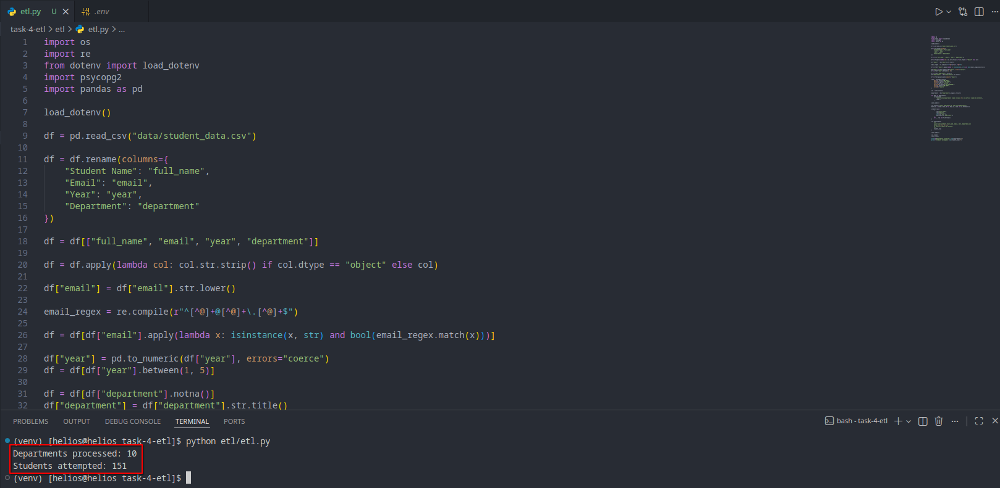
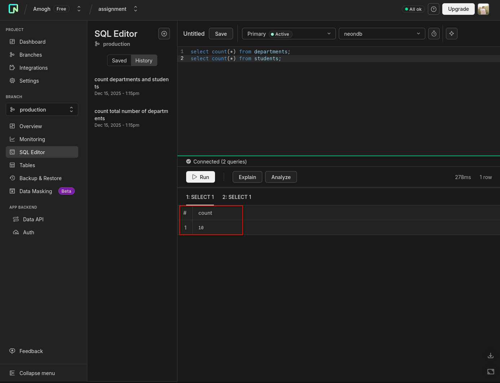
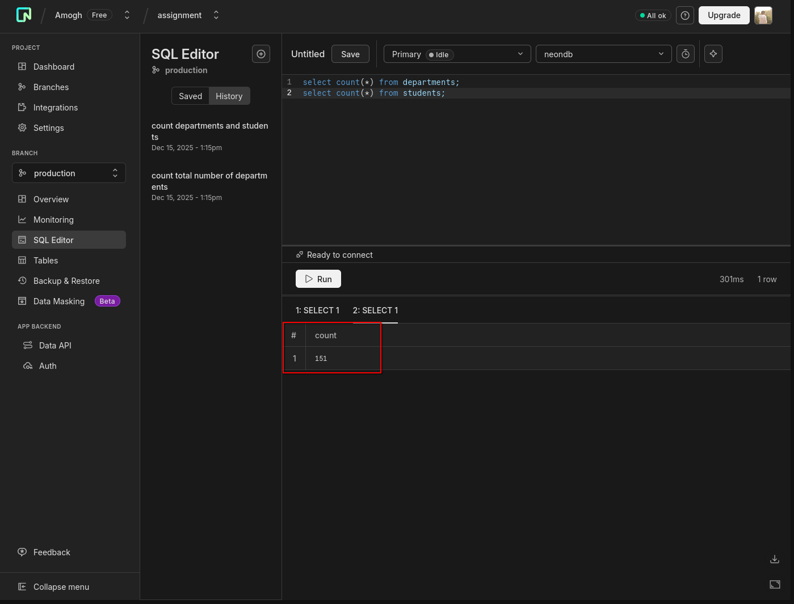

# Task 4 — ETL / Data Migration Pipeline

## Objective

The objective of Task 4 is to build a **fully functional ETL (Extract–Transform–Load) pipeline** that migrates raw, messy CSV data into a **NeonDB (PostgreSQL)** database while handling duplicates, invalid records, and schema constraints.

This task validates the database design from Task 3 and prepares the system for automation and real-time ingestion workflows.

---

## Tech Stack

* Python 3
* Pandas
* psycopg2
* NeonDB (PostgreSQL-compatible)

---

## Folder Structure

```
task-4-etl/
├── etl/
│   └── etl.py
├── data/
│   └── student_registration_raw.csv
├── logs/
├── requirements.txt
└── .env
```

---

## Extract Phase

### Source

* Input data is a CSV file located at `data/student_registration_raw.csv`
* Total raw rows: **250**

### Extraction Logic

* Data is loaded using `pandas.read_csv`
* Raw column schema is inspected before transformation

---

## Transform Phase

### Raw → Canonical Column Mapping

| Raw Column   | Canonical Column |
| ------------ | ---------------- |
| Student Name | full_name        |
| Email        | email            |
| Year         | year             |
| Department   | department       |

### Transformation Rules

* Trim whitespace from all string fields
* Convert email addresses to lowercase
* Validate email format using regex
* Convert academic year to numeric and restrict range (1–5)
* Drop rows with missing or invalid department values
* Normalize department names (case consistency)
* Deduplicate students based on email (keep first occurrence)

### Transformation Result

* Rows before transformation: **250**
* Rows after transformation: **151**

Invalid and duplicate records are filtered deterministically.

---

## Load Phase

### Target Database

* **NeonDB (PostgreSQL)**
* Schema pre-applied using `schema.sql` from Task 3

### Load Order

1. Departments
2. Students

This order respects foreign key constraints.

### Load Strategy

* Departments inserted using `ON CONFLICT DO NOTHING`
* Department IDs fetched and mapped in memory
* Students inserted using batch inserts (`executemany`)
* Duplicate students skipped using unique email constraint
* Single transaction per table for consistency and performance

### Load Result

* Departments inserted: **10**
* Students inserted: **151**

The pipeline is idempotent and safe to re-run.

---

## Error Handling & Stability

* Invalid rows removed during transformation
* Database constraints prevent duplicate inserts
* Batch commits avoid partial or inconsistent writes
* SSL connection enforced for NeonDB

---

## Scope Clarification

* This ETL pipeline loads **master data only** (departments and students)
* Course and enrollment ingestion is intentionally out of scope for Task 4
* The schema supports future ingestion of additional entities

---

## Validation

Post-load validation performed directly on NeonDB:

* Verified department count
* Verified student count
* Confirmed foreign key integrity

### Screenshots

Below screenshots demonstrate successful ETL execution and verification:

#### ETL Execution Output



#### NeonDB Departments Table



#### NeonDB Students Table



---

## Task 4 Checklist

* [x] Extract data from CSV source
* [x] Inspect raw schema
* [x] Normalize and clean data
* [x] Deduplicate records
* [x] Validate data formats and ranges
* [x] Handle invalid data gracefully
* [x] Load data into NeonDB
* [x] Respect foreign key constraints
* [x] Use batch inserts for performance
* [x] Validate inserted data

---

## Status

**Task 4 — COMPLETED**

The ETL pipeline is cloud-connected, validated, and production-ready, and forms the foundation for automation and real-time ingestion workflows in subsequent tasks.
