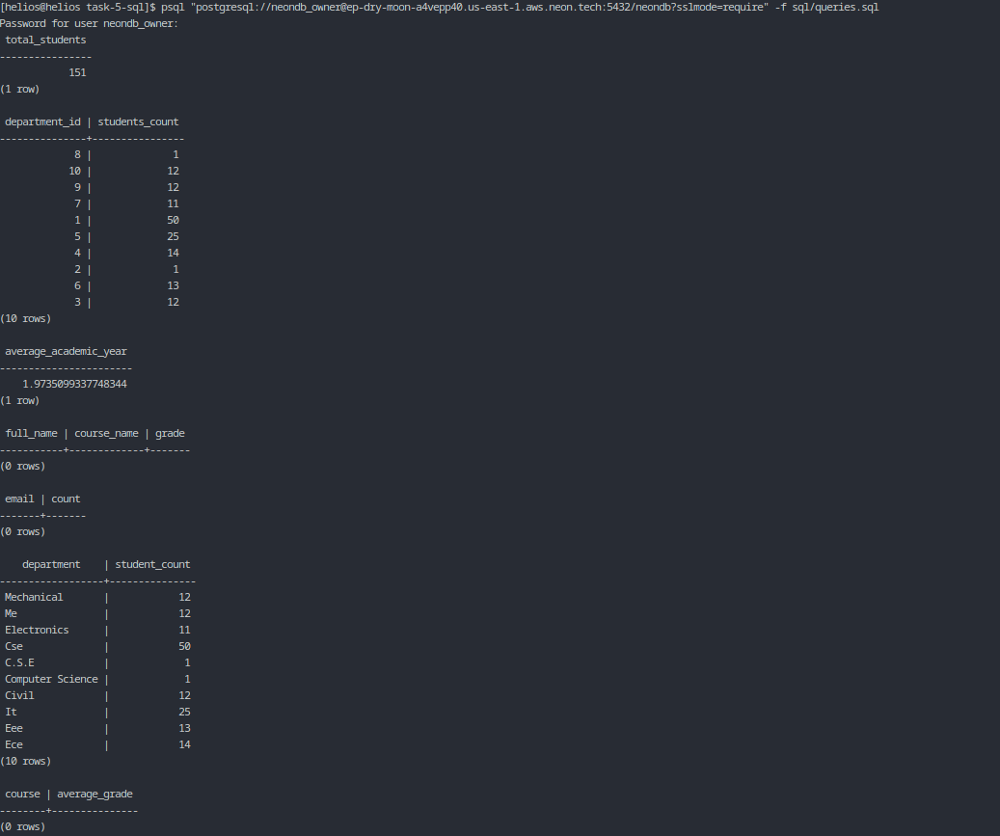
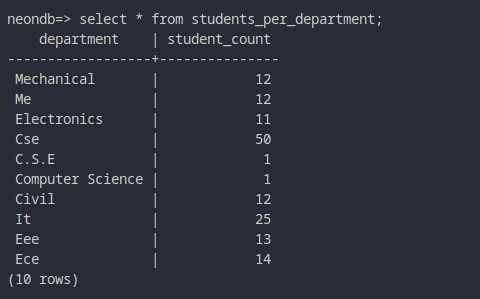
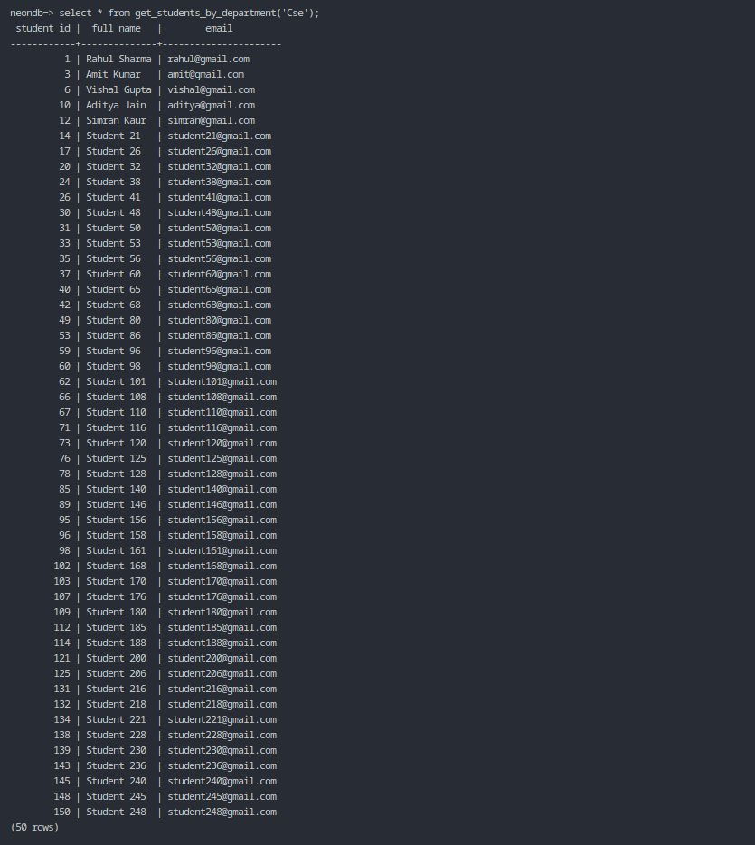
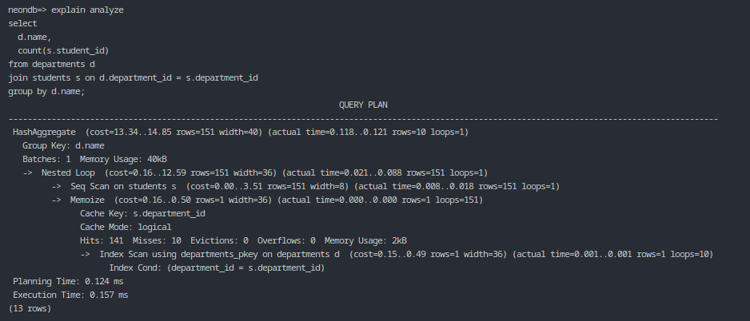

# Task 5 — SQL Development & Optimization

## Objective

The objective of Task 5 is to demonstrate strong SQL proficiency by writing **analytical queries, JOIN-heavy reports, views, stored procedures**, and validating **query performance using EXPLAIN / ANALYZE** on a production-grade PostgreSQL database hosted on **NeonDB**.

This task operates on the schema designed in Task 3 and the data ingested via the ETL pipeline in Task 4.

---

## Folder Structure

```
task-5-sql/
└── sql/
    ├── queries.sql
    ├── views.sql
    └── procedures.sql
```

---

## Queries (queries.sql)

### Aggregations

* Total number of students
* Students grouped by department
* Average academic year

These queries validate usage of `COUNT` and `AVG` aggregations.

---

### JOIN-heavy Query

A multi-table JOIN was written across:

* students
* enrollments
* courses

This validates schema correctness and relationship design. The query returns no rows because enrollment data is not yet populated, which is expected and documented.

---

### Duplicate Detection

A duplicate detection query based on student email verifies:

* ETL deduplication logic
* UNIQUE(email) constraint enforcement

Result: **No duplicate records found**.

---

### Reports

#### Students per Department

A report showing the number of students per department was generated using joins and grouping.

The output highlights data normalization issues inherited from raw data (e.g., department name variants), demonstrating realistic data quality challenges.

#### Average Grade per Course

A grade-mapping aggregation query was implemented to compute average grades per course. No rows are returned due to absence of enrollment data, which is expected.

---

## Views (views.sql)

A reusable reporting view was created:

* `students_per_department`

This view encapsulates a common aggregation query and simplifies downstream reporting.

---

## Stored Procedures / Functions (procedures.sql)

A PostgreSQL function was implemented:

* `get_students_by_department(dept_name text)`

The function returns all students belonging to a given department and demonstrates:

* Parameterized queries
* Encapsulation of business logic in the database

---

## Query Optimization

Query performance was evaluated using:

```sql
EXPLAIN ANALYZE
```

The execution plan confirms:

* Index usage on foreign keys
* Efficient join strategies
* Acceptable execution cost for analytical queries

---

## Screenshots

The following screenshots provide visual verification of SQL execution and optimization results.

### Aggregation & Report Queries



### Students per Department View



### Stored Procedure Execution



### EXPLAIN ANALYZE Output



---

## Task 5 Checklist

* [x] Aggregation queries (COUNT, AVG)
* [x] JOIN-heavy queries across multiple tables
* [x] Duplicate detection queries
* [x] Analytical reports
* [x] Views created and tested
* [x] Stored procedure created and tested
* [x] Query optimization using EXPLAIN / ANALYZE

---

## Status

**Task 5 — COMPLETED**

All SQL queries, views, procedures, and performance checks have been successfully executed and validated on NeonDB.
