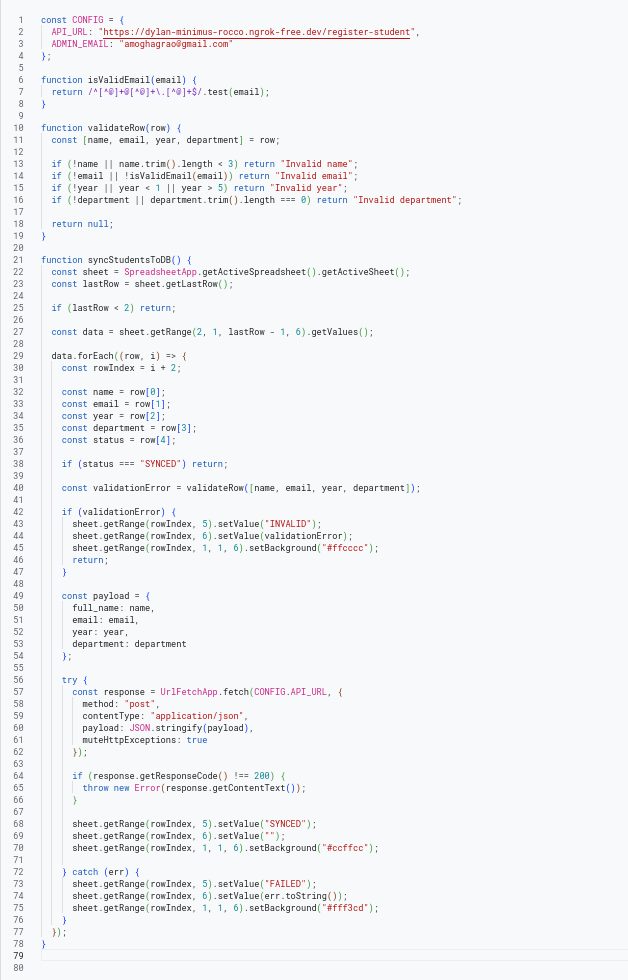
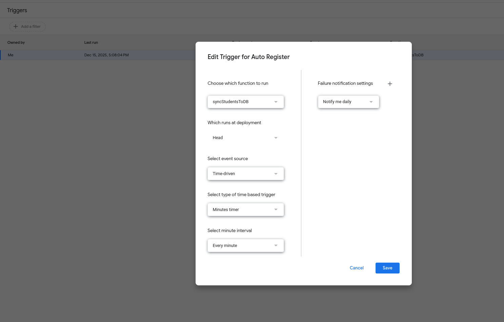
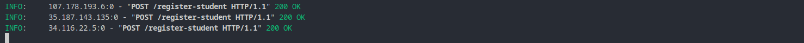
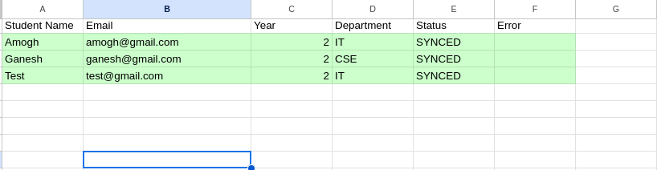

# Task 6 — Google Apps Script Automation

## Objective

Automate Google Sheets workflows to enable automatic student registration into NeonDB using a backend API.

The system validates data entered in Google Sheets, synchronizes valid records to NeonDB via a FastAPI backend, and updates the sheet with status and error information. The workflow runs **automatically** using a time-driven trigger.

---

### Google Sheets link : [Google Sheets](https://docs.google.com/spreadsheets/d/1jtN-7paAj3aADeA6_oFrVmOos9WsT94ujSmGtdlIUiY/edit?usp=sharing) 
### Appscript Project Link : [Appscript Project](https://script.google.com/u/0/home/projects/1K6nP-6fZmXCBwW91bDX0HlXzpSA6eVrYTQsN8mgSfWg8KBsbq2DWrkmb)

## Architecture Overview

Google Sheets → Google Apps Script → FastAPI → NeonDB

* Google Sheets acts as the data entry interface
* Google Apps Script handles validation, automation, and API communication
* FastAPI exposes REST endpoints for data ingestion
* NeonDB stores the final normalized data

---

## Why Time-Driven Automation

Edit-based triggers were intentionally avoided due to recursive execution issues and race conditions commonly observed in Google Apps Script.

A **time-driven trigger** was implemented instead to ensure:

* Reliability
* Idempotent execution
* Predictable behavior
* Easier debugging and observability

This approach aligns with real-world backend automation practices.

---

## Implementation Details

### Validation Rules

* Student name must be at least 3 characters
* Email must follow a valid email format
* Academic year must be between 1 and 5
* Department must be non-empty

### Status Handling

* `SYNCED` → Successfully inserted into NeonDB
* `INVALID` → Failed validation (highlighted red)
* `FAILED` → Backend/API error (highlighted yellow)

Already synced rows are skipped to prevent duplicate inserts.

---

## Automation Setup

* A Google Apps Script function scans the sheet periodically
* Only unsynced rows are processed
* Valid rows are sent to the FastAPI endpoint
* Sheet UI is updated based on the result

The automation is triggered using a **time-driven trigger** configured to run at fixed intervals.

---

## Screenshots

### Google Apps Script Code

### Time-Driven Trigger Configuration

### FastAPI Backend Receiving Requests

### Google Sheet After Automatic Sync

---

## Outcome

* Automatic registration workflow implemented successfully
* Fully functional Google Sheets → NeonDB pipeline
* Robust error handling and validation
* Demonstrable, stable, and production-oriented solution

This completes **Task 6 — Google Apps Script Automation**.
