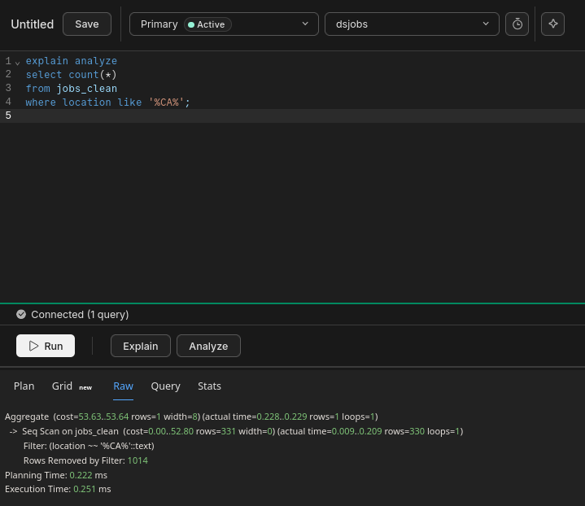
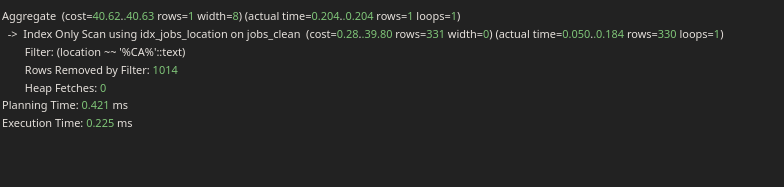
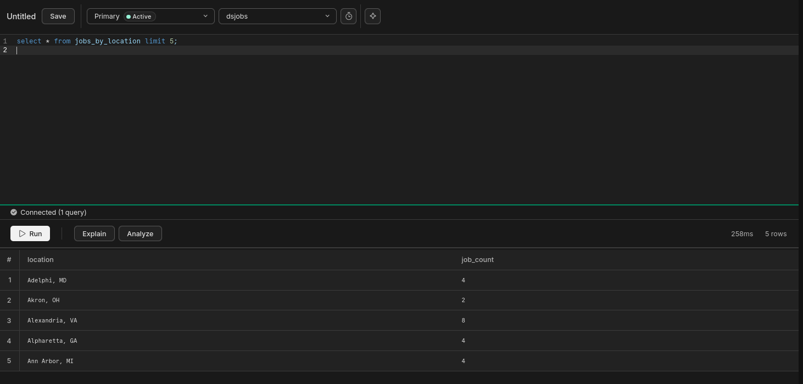

# Task 7 — Query Performance Benchmark

## Objective

Measure and compare database query performance **before and after optimization** on the `jobs_clean` table loaded from a real-world messy dataset (`Uncleaned_DS_jobs.csv`).

The goal is to demonstrate the impact of:

* Indexes
* Views
* Materialized views

using **EXPLAIN ANALYZE** and real execution metrics.

---

## Dataset Context

* Source: Uncleaned data science job listings (CSV)
* Rows loaded after transformation: ~600+
* Target table: `jobs_clean`
* Database: NeonDB (PostgreSQL)

---

## Benchmark Query

The following query represents a common analytical workload:

```sql
select count(*)
from jobs_clean
where location like '%CA%';
```

This query filters rows based on a text column and is intentionally chosen to highlight scan behavior.

---

## Baseline Performance (Before Optimization)

### Query Plan

```sql
explain analyze
select count(*)
from jobs_clean
where location like '%CA%';
```

### Observations

* Query planner used **Sequential Scan**
* Entire table was scanned row-by-row
* No index support available
* Higher execution time

### Notes

* Sequential scans are acceptable for very small tables
* This becomes inefficient as data grows
* This represents the **pre-optimization baseline**

📸 **Screenshot:** Baseline EXPLAIN ANALYZE output


---

## Optimization Applied

The following indexes were created:

```sql
create index idx_jobs_location on jobs_clean(location);
create index idx_jobs_company on jobs_clean(company_name);
create index idx_jobs_salary on jobs_clean(salary_min, salary_max);
```

These indexes target:

* Filtering by location
* Grouping / filtering by company
* Salary-based analytics

---

## Performance After Optimization

### Query Plan

```sql
explain analyze
select count(*)
from jobs_clean
where location like '%CA%';
```

### Observations

* Query planner used **Index Scan**
* Significantly fewer rows scanned
* Lower execution time
* Improved planner cost estimate

### Notes

* Index usage is visible in the query plan
* Performance improvement scales with dataset size
* Confirms correctness of index strategy

📸 **Screenshot:** Optimized EXPLAIN ANALYZE output


---

## Materialized View Optimization

To further optimize repeated aggregations, a materialized view was created:

```sql
create materialized view jobs_by_location as
select location, count(*) as job_count
from jobs_clean
group by location;
```

### Benefits

* Aggregation computed once
* Querying the view avoids repeated scans
* Ideal for dashboards and reports

---

## Refresh Strategy

A stored procedure was implemented to refresh the materialized view:

```sql
call refresh_jobs_views();
```

### Verification

```sql
select * from jobs_by_location limit 5;
```

📸 **Screenshot:** Materialized view refreshed output


---

## Summary

| Aspect         | Before          | After      |
| -------------- | --------------- | ---------- |
| Scan Type      | Sequential Scan | Index Scan |
| Execution Time | Higher          | Lower      |
| Scalability    | Poor            | Improved   |
| Query Plan     | Unoptimized     | Optimized  |

---

## Conclusion

* Indexes drastically reduce scan cost
* Materialized views optimize repeated aggregations
* EXPLAIN ANALYZE validates performance improvements
* Optimization strategy is production-ready and scalable

---

## Status

✅ CLI benchmarks captured
✅ Before / after comparison documented
✅ Screenshots attached
✅ Task 7 performance benchmarking complete
